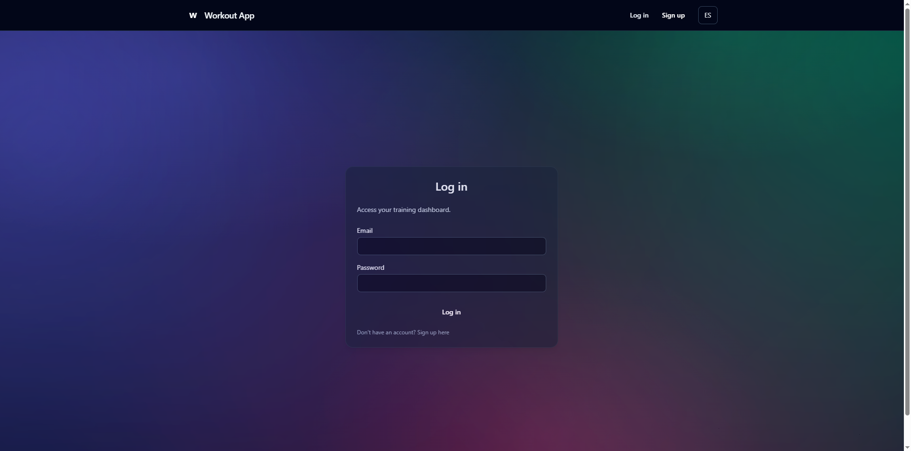
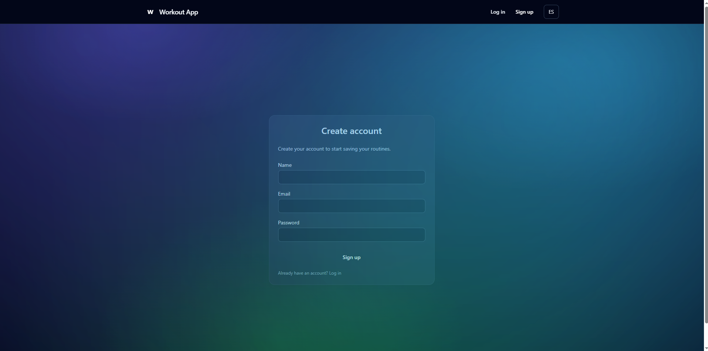
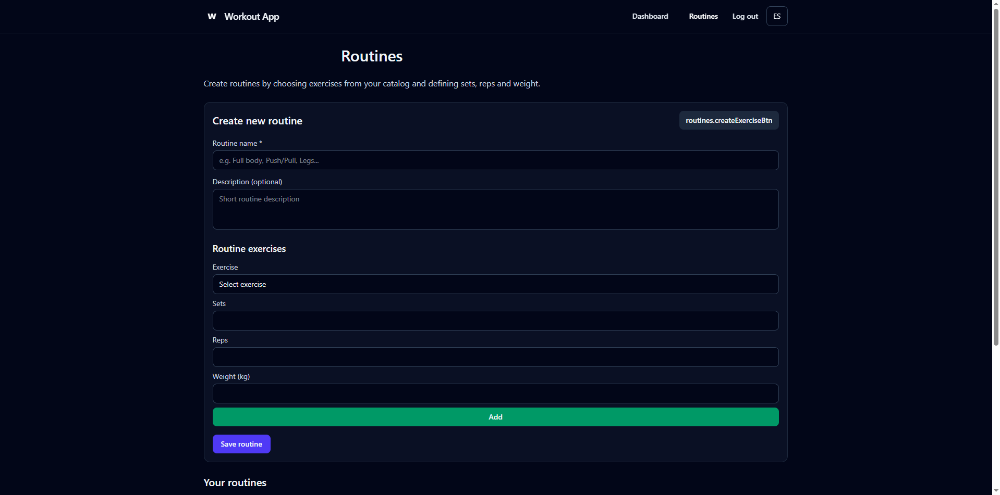
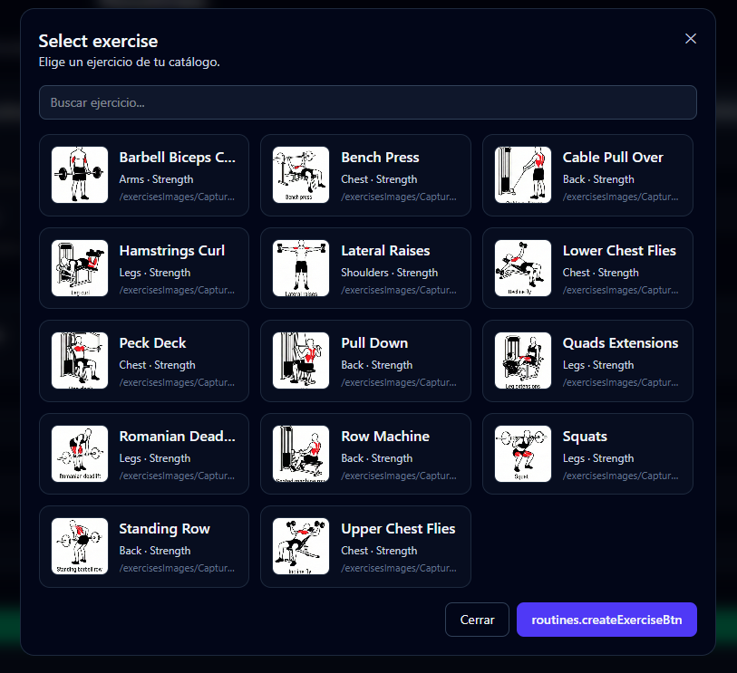
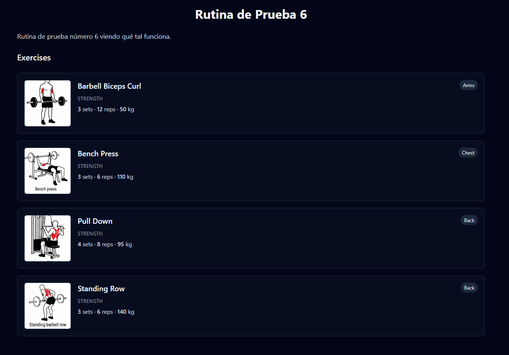
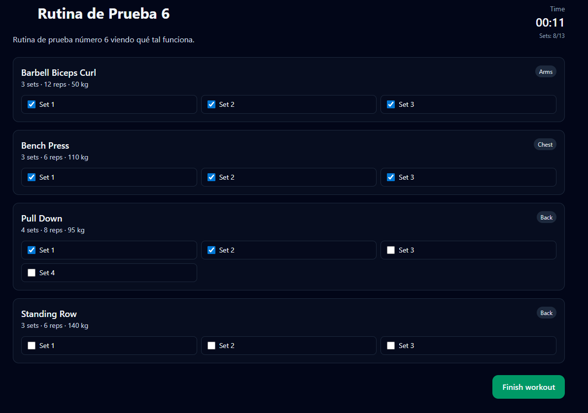

# Workout App – Production Version

This repository contains the **Production Version** of **Workout App**, a full-stack web application designed to help users **create, manage and prepare structured workout routines** through a clean, scalable and modern architecture.

The application provides a complete end-to-end flow: authentication, exercise catalog with images, routine creation, internationalization (i18n), and a robust backend–frontend integration.  
The codebase is structured to support future expansion into **active workout tracking and performance analysis**.

🌐 **Live application:**  
https://workout-app-peka.vercel.app

---

## 🚀 Tech Stack

### Frontend
- React (Vite)
- React Router DOM
- Tailwind CSS
- Axios
- Custom internationalization system (ES / EN)

### Backend
- Node.js + Express
- MongoDB Atlas + Mongoose
- JWT-based authentication
- bcrypt for secure password hashing
- Middleware-protected routes
- CORS enabled

---

## 📌 Core Features

### 🔐 Authentication & Security
- User registration (email, password, name)
- Secure login using JWT tokens
- Automatic migration of legacy plaintext passwords to bcrypt
- Protected frontend routes
- Persistent sessions using localStorage

---
## 📸 Application Screenshots

### 🔐 Authentication

  
  

---

### 🏋️ Routine Creation & Exercise Catalog

  

  

---

### 📄 Routine Detail View

  

---

### ▶️ Workout Execution (In Progress)

  

---

### 🌍 Internationalization (i18n)
- Full application language switching (Spanish / English)
- Language toggle available in the navigation bar
- All UI text centralized via translation keys
- Architecture ready for additional languages

---

### 🏋️ Exercise Catalog
- Centralized exercise catalog stored in MongoDB
- Each exercise includes:
  - Name
  - Muscle group
  - Training type
  - Image
- Exercises can be:
  - Selected when creating routines
  - Created manually by the user if needed
- Images served from the frontend public directory

---

### 🧩 Routines Management
- View all routines created by the logged-in user
- Create routines by selecting exercises from the catalog
- Define per exercise:
  - Sets
  - Repetitions
  - Weight
- Prevention of duplicate exercises with identical parameters
- Visual routine cards for quick navigation

---

### 📄 Routine Detail View
- Route: /routines/:id
- Displays full routine information:
  - Exercise list
  - Sets, reps and weight
  - Populated exercise metadata
- Serves as the base for future workout execution features

---

## ⚙️ Backend API (Main Endpoints)

- POST /api/auth/register – Register user  
- POST /api/auth/login – Login user  
- GET /api/exercises – Retrieve exercise catalog  
- POST /api/exercises – Create new exercise  
- GET /api/routines – Retrieve user routines  
- POST /api/routines – Create routine  
- GET /api/routines/:id – Retrieve routine details  

---

## 🚀 Deployment

The application is deployed using a **split frontend–backend strategy**, optimized for scalability and maintainability.

### Frontend Deployment (Vercel)
- The frontend is deployed on **Vercel**
- Automatic deployments are triggered on every push to the main branch
- Vercel provides fast global CDN delivery and excellent performance for the React (Vite) frontend

### Backend Deployment (Render)
- The backend API is deployed on **Render**
- Render uses a **free-tier instance**, which automatically goes to sleep after approximately **15 minutes of inactivity**
- When the backend is asleep:
  - The **first incoming request** will take longer (usually 1–2 minutes) while the service spins up
  - Once the backend is active, **subsequent requests respond normally with low latency**
- This behavior is expected and documented, and does not affect functionality once the service is running

This deployment setup is cost-effective and suitable for production demos, portfolios and early-stage applications.  
The architecture can be easily migrated to always-on services if required in the future.

---

## 🛠️ Installation & Local Setup

### Requirements
- Node.js (v16+ recommended)
- MongoDB Atlas account

---

### Backend Setup

1. Navigate to the backend folder and install dependencies:

    cd backend  
    npm install

2. Create a .env file in the backend root:

    MONGODB_URI=your_mongodb_atlas_uri_here  
    JWT_SECRET=your_jwt_secret  
    PORT=5000

3. Start the backend server:

    npm run dev

Backend runs on:

    http://localhost:5000

---

### Frontend Setup

1. Navigate to the frontend folder and install dependencies:

    cd frontend  
    npm install

2. Start the frontend development server:

    npm run dev

Frontend runs on:

    http://localhost:5173

---

## 🧪 Production Summary

This Production Version demonstrates that:

- The application architecture is clean, scalable and maintainable
- Backend and frontend communicate reliably
- Authentication and authorization are securely implemented
- Exercise catalog and routines are fully functional
- Internationalization works globally across the app
- Data migrations and backward compatibility are handled safely
- The project is ready to grow into more advanced fitness and analytics features

---

## 👤 Author

*Ángel Pérez Castro* 
**Junior Software Engineer** with a strong interest in **Artificial Intelligence and applied machine learning**.  
Focused on building clean, scalable full-stack applications while continuously expanding expertise in AI-driven systems, data-oriented architectures and modern software engineering practices.
